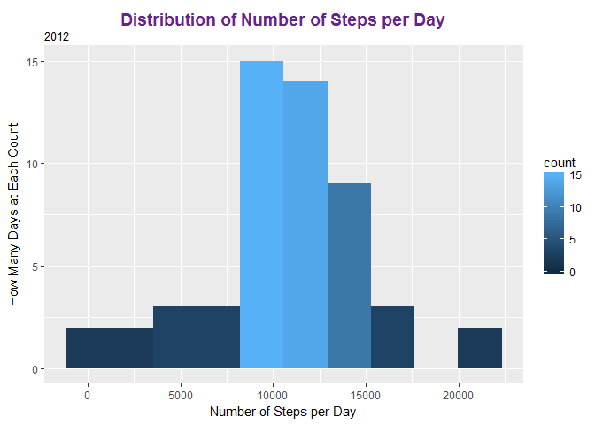

# Reproducible Research: Peer Assessment 1


## Loading and preprocessing the data


```r
        install.packages('dplyr', repos="http://cran.rstudio.com/")
```

```
## Installing package into 'C:/Users/Victoria/Documents/R/win-library/3.3'
## (as 'lib' is unspecified)
```

```
## package 'dplyr' successfully unpacked and MD5 sums checked
## 
## The downloaded binary packages are in
## 	C:\Users\Victoria\AppData\Local\Temp\RtmpALpWWs\downloaded_packages
```

```r
        library(dplyr)
```

```
## Warning: package 'dplyr' was built under R version 3.3.3
```

```
## 
## Attaching package: 'dplyr'
```

```
## The following objects are masked from 'package:stats':
## 
##     filter, lag
```

```
## The following objects are masked from 'package:base':
## 
##     intersect, setdiff, setequal, union
```

```r
        install.packages('dtplyr', repos="http://cran.rstudio.com/")
```

```
## Installing package into 'C:/Users/Victoria/Documents/R/win-library/3.3'
## (as 'lib' is unspecified)
```

```
## package 'dtplyr' successfully unpacked and MD5 sums checked
## 
## The downloaded binary packages are in
## 	C:\Users\Victoria\AppData\Local\Temp\RtmpALpWWs\downloaded_packages
```

```r
        library(dtplyr)
```

```
## Warning: package 'dtplyr' was built under R version 3.3.3
```

```r
        install.packages('ggplot2', repos="http://cran.rstudio.com/")
```

```
## Installing package into 'C:/Users/Victoria/Documents/R/win-library/3.3'
## (as 'lib' is unspecified)
```

```
## package 'ggplot2' successfully unpacked and MD5 sums checked
## 
## The downloaded binary packages are in
## 	C:\Users\Victoria\AppData\Local\Temp\RtmpALpWWs\downloaded_packages
```

```r
        library(ggplot2)
```

```
## Warning: package 'ggplot2' was built under R version 3.3.3
```

```r
        workingdir <- getwd()
        
        destfile <- paste(workingdir, "/activity.csv", sep = "")
        if (!file.exists(destfile)) {
                print("got here")
                #  messge stub for a possible error handler
                print(paste("activity.csv ", 
                            "does not exist in the working direct ",
                            "- please put it there"))
                
        } else {

                activity <- read.csv("activity.csv" , header = TRUE)
                tblactivity <- tbl_df(activity)
                rm(activity)
        }
```


## What is mean total number of steps taken per day?
### Make a histogram of the total number of steps taken each day

```r
        tblsteps <- tblactivity %>%
        select(steps,
               date,
               interval) %>%
        filter(!is.na(steps))%>%
        mutate(intervaldate = as.Date(date, format = "%Y-%m-%d")) %>%
        arrange(intervaldate) %>%
        group_by(intervaldate) %>%
        summarise(daysteps = sum(steps))

        plot1 <- ggplot(tblsteps, aes(daysteps))
        plot1 <- plot1 + geom_histogram(bins = 10, aes(fill = ..count..))
        plot1 <- plot1 + labs(x = "Number of Steps per Day" ,
                              y = "How Many Days at Each Count", 
                              title = "Distribution of Number of Steps per Day",
                              subtitle = "2012")
        plot1 <- plot1 + theme(plot.title=element_text(size=14, 
                                                       hjust=0.5, 
                                                       face="bold", 
                                                       colour="darkorchid4", 
                                                       vjust=-1)) 
 
        
        print(plot1)
```

<!-- -->

```r
### Calculate and report the mean and median total number of steps taken per day
```

```r
        tblstats <- tblactivity %>%
                select(steps,
                       date) %>%
                filter(!is.na(steps)) %>%
                group_by(date) %>%
                summarise(totalsteps = sum(steps))
        
        tblstats <- tblstats %>%
                select(totalsteps) %>%
                summarise(meansteps = mean(totalsteps), mediansteps = median(totalsteps))
        
        strmean <- paste("The mean total number of steps take per day = ", tblstats$meansteps)
        strmedian <- paste("The median total number of steps take per day = ", tblstats$mediansteps)
        print(strmean)
```

```
## [1] "The mean total number of steps take per day =  10766.1886792453"
```

```r
        print(strmedian)
```

```
## [1] "The median total number of steps take per day =  10765"
```

        ## What is the average daily activity pattern?


## Imputing missing values


## Are there differences in activity patterns between weekdays and weekends?
