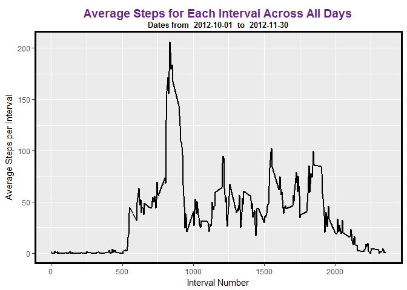

# Reproducible Research: Peer Assessment 1
Victoria Cocco  


## Loading and preprocessing the data
### Load the data (i.e. read.csv())
### Process/transform the data (if necessary) into a format suitable for your analysis


```r
        install.packages('dplyr', repos="http://cran.rstudio.com/")
```

```
## Installing package into 'C:/Users/Victoria/Documents/R/win-library/3.3'
## (as 'lib' is unspecified)
```

```
## package 'dplyr' successfully unpacked and MD5 sums checked
## 
## The downloaded binary packages are in
## 	C:\Users\Victoria\AppData\Local\Temp\RtmpmkjJpK\downloaded_packages
```

```r
        library(dplyr)
```

```
## Warning: package 'dplyr' was built under R version 3.3.3
```

```
## 
## Attaching package: 'dplyr'
```

```
## The following objects are masked from 'package:stats':
## 
##     filter, lag
```

```
## The following objects are masked from 'package:base':
## 
##     intersect, setdiff, setequal, union
```

```r
        install.packages('dtplyr', repos="http://cran.rstudio.com/")
```

```
## Installing package into 'C:/Users/Victoria/Documents/R/win-library/3.3'
## (as 'lib' is unspecified)
```

```
## package 'dtplyr' successfully unpacked and MD5 sums checked
## 
## The downloaded binary packages are in
## 	C:\Users\Victoria\AppData\Local\Temp\RtmpmkjJpK\downloaded_packages
```

```r
        library(dtplyr)
```

```
## Warning: package 'dtplyr' was built under R version 3.3.3
```

```r
        install.packages('ggplot2', repos="http://cran.rstudio.com/")
```

```
## Installing package into 'C:/Users/Victoria/Documents/R/win-library/3.3'
## (as 'lib' is unspecified)
```

```
## package 'ggplot2' successfully unpacked and MD5 sums checked
## 
## The downloaded binary packages are in
## 	C:\Users\Victoria\AppData\Local\Temp\RtmpmkjJpK\downloaded_packages
```

```r
        library(ggplot2)
```

```
## Warning: package 'ggplot2' was built under R version 3.3.3
```

```r
        workingdir <- getwd()
        
        destfile <- paste(workingdir, "/activity.csv", sep = "")
        if (!file.exists(destfile)) {
                print("got here")
                #  messge stub for a possible error handler
                print(paste("activity.csv ", 
                            "does not exist in the working direct ",
                            "- please put it there"))
                
        } else {

                activity <- read.csv("activity.csv" , header = TRUE)
                tblactivity <- tbl_df(activity)
                rm(activity)
        }
```


## What is mean total number of steps taken per day?
### Make a histogram of the total number of steps taken each day

```r
        tblsteps <- tblactivity %>%
        select(steps,
               date,
               interval) %>%
        filter(!is.na(steps))%>%
        mutate(intervaldate = as.Date(date, format = "%Y-%m-%d")) %>%
        arrange(intervaldate) %>%
        group_by(intervaldate) %>%
        summarise(daysteps = sum(steps))

        plot1 <- ggplot(tblsteps, aes(daysteps))
        plot1 <- plot1 + geom_histogram(bins = 10, aes(fill = ..count..))
        plot1 <- plot1 + labs(x = "Number of Steps per Day" ,
                              y = "How Many Days at Each Count", 
                              title = "Distribution of Number of Steps per Day",
                              subtitle = "2012")
        plot1 <- plot1 + theme(plot.title=element_text(size=14, 
                                                       hjust=0.5, 
                                                       face="bold", 
                                                       colour="darkorchid4", 
                                                       vjust=-1)) 
 
        
        print(plot1)
```

<!-- -->

### Calculate and report the mean and median total number of steps taken per day

```r
        tblstats <- tblactivity %>%
                select(steps,
                       date) %>%
                filter(!is.na(steps)) %>%
                group_by(date) %>%
                summarise(totalsteps = sum(steps))
        
        tblstats <- tblstats %>%
                select(totalsteps) %>%
                summarise(meansteps = mean(totalsteps), mediansteps = median(totalsteps))
        
        strmean <- paste("The mean total number of steps take per day = ",
                         format(tblstats$meansteps, nsmall = 3))
        strmedian <- paste("The median total number of steps take per day = ",
                         tblstats$mediansteps)
        print(strmean)
```

```
## [1] "The mean total number of steps take per day =  10766.189"
```

```r
        print(strmedian)
```

```
## [1] "The median total number of steps take per day =  10765"
```

## What is the average daily activity pattern?
### Make a time series plot  of the 5-minute interval x-axis,
### and the average number of steps taken, averaged across all days y-axis


```r
        tblintervals <- tblactivity %>%
                select(steps,
                       interval,
                       date) %>%
                filter(!is.na(steps)) %>%
                arrange(interval) %>%
                group_by(interval) %>%
                summarise(intervalmeansteps = mean(steps))

        # get the interval with the highest mean of steps
        tblmaxinterval <- tblintervals %>%
                        arrange(intervalmeansteps)
        
        # find the max mean step interval
        maxrow <- nrow(tblmaxinterval)
        maxinterval <- tblmaxinterval[maxrow, 1]
        maxmeansteps <- tblmaxinterval[maxrow,2]
        
        # get the interval dates
        tbldates <- tblactivity %>%
                select(date) %>%
                mutate(intervaldate = as.Date(date, format = "%Y-%m-%d")) %>%
                arrange(intervaldate) %>%
                summarise(mindate = min(intervaldate), maxdate = max(intervaldate))

        
        mindate <- tbldates[1,1]
        maxdate <- tbldates[1,2]
        
        # plot the histogram of steps each day
        plot3 <- ggplot(tblintervals, aes(x =interval, 
                                      y = intervalmeansteps))
        plot3 <- plot3 + geom_line(size=1)
        plot3 <- plot3 + labs(x = "Interval Number" ,
                              y = "Average Steps per Interval", 
                              title = "Average Steps for Each Interval Across All Days",
                              subtitle = paste("Dates from ", 
                                                format(mindate, format="%Y-%m-%d"),
                                                " to ",
                                                format(maxdate, format="%Y-%m-%d")))
        plot3 <- plot3 + theme(plot.title=element_text(size=14, 
                                                       hjust=0.5, 
                                                       face="bold", 
                                                       colour="darkorchid4", 
                                                       vjust=-1))
        plot3 <- plot3 + theme(plot.subtitle=element_text(size=10, 
                                                          hjust=0.5, 
                                                          face="bold", 
                                                          colour="black", 
                                                          vjust=-1))
        plot3 <- plot3 + theme(panel.border = element_rect(colour = "black",
                                                           fill=NA, 
                                                           size=2))
          
        
        print(plot3)
```

<!-- -->

```r
        submsg <- "Highest average interval "
        submsg <- paste(submsg, maxinterval)
        submsg <- paste(submsg, " with a mean of ")
        submsg <- paste(submsg, format(maxmeansteps, nsmall=3))
        print(submsg)
```

```
## [1] "Highest average interval  835  with a mean of  206.1698"
```


## Imputing missing values
### Calculate and report the total number of missing values in the dataset
### (i.e. the total number of rows with NAs)

```r
        tblNAs <- tblactivity %>%
        select(steps,
               interval,
               date) %>%
        filter(is.na(steps))

        numNAs <- nrow(tblNAs)
        strmsg <- "The total number of missing values in the dataset is "
        print(paste(strmsg, numNAs))
```

```
## [1] "The total number of missing values in the dataset is  2304"
```
### Devise a strategy for filling in all of the missing values in the dataset. 
### The strategy does not need to be sophisticated. 
### For example, you could use the mean/median for that day, 
### or the mean for that 5-minute interval, etc.
### Create a new dataset that is equal to the original dataset but with the missing data filled in

```r
        tblstats <- tblactivity %>%
                select(steps,
                       date) %>%
                filter(!is.na(steps)) %>%
                group_by(date) %>%
                summarise(totalsteps = sum(steps))
        
        tblstats <- tblstats %>%
                select(totalsteps) %>%
                summarise(meansteps = mean(totalsteps), mediansteps = median(totalsteps))
                tblstats <- tblactivity %>%
                select(steps,
                       date) %>%
                filter(!is.na(steps)) %>%
                group_by(date) %>%
                summarise(totalsteps = sum(steps))
        
        tblstats <- tblstats %>%
                select(totalsteps) %>%
                summarise(meansteps = mean(totalsteps), mediansteps = median(totalsteps))
        
        
        tblintervalmeans <- tblactivity %>%
                select(steps,
                       interval,
                       date) %>%
                filter(!is.na(steps)) %>%
                arrange(interval) %>%
                group_by(interval) %>%
                summarise(intervalmeansteps = mean(steps))
        
        tblintervals <- tblactivity %>%
                select(steps,
                       interval,
                       date) %>%
                filter(!is.na(steps))

        tblimputedNAs <- left_join(tblNAs, tblintervalmeans, by = "interval")
        tblimputedNAs <- select(tblimputedNAs, intervalmeansteps, interval, date)
        colnames(tblimputedNAs) <- c('steps', 'interval', 'date')
        
        tblcomplete <- rbind(tblintervals, tblimputedNAs)
        
        tblsteps <- tblcomplete %>%
                select(steps,
                       date,
                       interval) %>%
                filter(!is.na(steps))%>%
                mutate(intervaldate = as.Date(date, format = "%Y-%m-%d")) %>%
                arrange(intervaldate) %>%
                group_by(intervaldate) %>%
                summarise(daysteps = sum(steps))
```
### Make a histogram of the total number of steps taken each day and
### Calculate and report the mean and median total number of steps taken per day. 
### Do these values differ from the estimates from the first part of the assignment? 
### What is the impact of imputing missing data on the estimates of the total daily number of steps?


```r
        tblsteps <- tblcomplete %>%
                select(steps,
                       date,
                       interval) %>%
                filter(!is.na(steps))%>%
                mutate(intervaldate = as.Date(date, format = "%Y-%m-%d")) %>%
                arrange(intervaldate) %>%
                group_by(intervaldate) %>%
                summarise(daysteps = sum(steps))
        
        tblsteps <- tblcomplete %>%
                select(steps,
                        date,
                        interval) %>%
                filter(!is.na(steps))%>%
                mutate(intervaldate = as.Date(date, format = "%Y-%m-%d")) %>%
                arrange(intervaldate) %>%
                group_by(intervaldate) %>%
                summarise(daysteps = sum(steps))
        plot4 <- ggplot(tblsteps, aes(daysteps))
        plot4 <- plot4 + geom_histogram(bins = 10, aes(fill = ..count..))
        plot4 <- plot4 + labs(x = "Number of Steps per Day" ,
                      y = "How Many Days at Each Count", 
                      title = "Distribution of Number of Steps per Day with Imputed Interval Means",
                      subtitle = "2012")
        plot4 <- plot4 + theme(plot.title=element_text(size=14, 
                                                       hjust=0.5, 
                                                       face="bold", 
                                                       colour="darkorchid4", 
                                                       vjust=-1)) 

        print(plot4)
```

<!-- -->

```r
        tblimputedstats <- tblcomplete %>%
                select(steps,
                       date) %>%
                filter(!is.na(steps)) %>%
                group_by(date) %>%
                summarise(totalsteps = sum(steps))

        tblimputedstats <- tblimputedstats %>%
                select(totalsteps) %>%
                summarise(meansteps = mean(totalsteps), mediansteps = median(totalsteps))

        imputedmeandiff <- format(tblstats$meansteps - tblimputedstats$meansteps, nsmall=3)
        imputedmediandiff <- tblstats$mediansteps - tblimputedstats$mediansteps
        
        strmsg <- "The difference between mean with NAs and the imputed mean is "
        strmsg <- paste(strmsg, imputedmeandiff)
        print(strmsg)
```

```
## [1] "The difference between mean with NAs and the imputed mean is  0.000"
```

```r
        strmsg <- "The difference between median with NAs and the imputed median is "
        strmsg <- paste(strmsg, imputedmediandiff)
        print(strmsg)
```

```
## [1] "The difference between median with NAs and the imputed median is  -1.1886792452824"
```
## Are there differences in activity patterns between weekdays and weekends?
### Create a new factor variable in the dataset with two levels – “weekday” and “weekend”
### indicating whether a given date is a weekday or weekend day.

```r
        tbldaysteps <- tblcomplete %>%
                select(steps,
                       interval,
                       date) %>%
                mutate(intervaldate = as.Date(date, format = "%Y-%m-%d"))

        tbldaysteps <- tbldaysteps %>%
                select(steps,
                       interval, 
                       intervaldate) %>%
                mutate(datetype =  ifelse(weekdays(intervaldate)=="Saturday" |                                       weekdays(intervaldate)=="Sunday", "Weekend", "Weekday")) %>%
                arrange(datetype, interval) %>%
                group_by(datetype, interval) %>%
                summarise(meansteps = mean(steps))
```
### Make a panel plot containing a time series plotof the 5-minute interval (x-axis) 
### and the average number of steps taken, 
### averaged across all weekday days or weekend days (y-axis). 
### The plot should look something like the following, 
### which was created using simulated data:

```r
                cbPalette <- c("purple2", 
                               "blue4")
                
                #create the plot
                plot5 <- ggplot(tbldaysteps, aes(x= interval, 
                                             y= meansteps,
                                             group = datetype, 
                                             colour= datetype))
                plot5 <- plot5 + geom_line(size = 1) 
                plot5 <- plot5 + scale_colour_manual(values = cbPalette)
                plot5 <- plot5 + facet_wrap(~ datetype, ncol = 1, nrow = 2)
                plot5 <- plot5 + labs(x = "Interval Number" ,
                                      y = "Average Steps per Interval", 
                                      title = "Average Steps for Each Interval Across Each Day Type")
                plot5 <- plot5 + theme(plot.title=element_text(size=14, 
                                                               hjust=0.5, 
                                                               face="bold", 
                                                               colour="darkorchid4", 
                                                               vjust=-1))
                plot5 <- plot5 + theme(plot.subtitle=element_text(size=10, 
                                                                  hjust=0.5, 
                                                                  face="bold", 
                                                                  colour="black", 
                                                                  vjust=-1))
                plot5 <- plot5 + theme(panel.border = element_rect(colour = "black",
                                                                   fill=NA, 
                                                                   size=2))
                plot5 <- plot5 + theme(legend.position="none")
                print(plot5) 
```

<!-- -->
                
